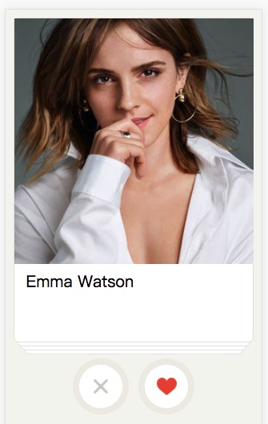

[](http://twitter.com/qq393464140)

# tantan
> 👆 Simulate tantan app interactive effect in web.

## Example

Coming soon.



or

* clone this repo.
* `cd factory && npm install && npm start`

## How to use

```html
<tantan
    ref="tantan"
    :list="list"
    @touchstart="touchstart"
    @touchmove="touchmove"
    @touchend="touchend"
    @touchcancel="touchcancel"
    @drag="drag"
    @drop="drop"
    @slideback="slideback"
    @slideleft="slideleft"
    @slideright="slideright"
    @slidebackend="slidebackend"
    @slideleftend="slideleftend"
    @sliderightend="sliderightend"
>
    <!-- use "slot-scope" in Vue 2.5.0+ -->
    <!-- use "scope" in Vue 2.4.4- -->
    <template slot="card" slot-scope="props">
        <!-- detail html -->
    </template>
</tantan>
```

## Imperfection

* `Border`: Now is using `0.5px` to simulate. However, browser could not render the rounded corner when it is transitioning or what else. There is a better way like using `background-image` or `canvas` as you like.

* `The draging effect`: That's a rotation effect in App, when you are draging the card.

* `Card pack sync animation`: The card pack under the first card has a translating effect in App, when you are draging the first card.

* `Button event`: Not finished yet.

## License

MIT
